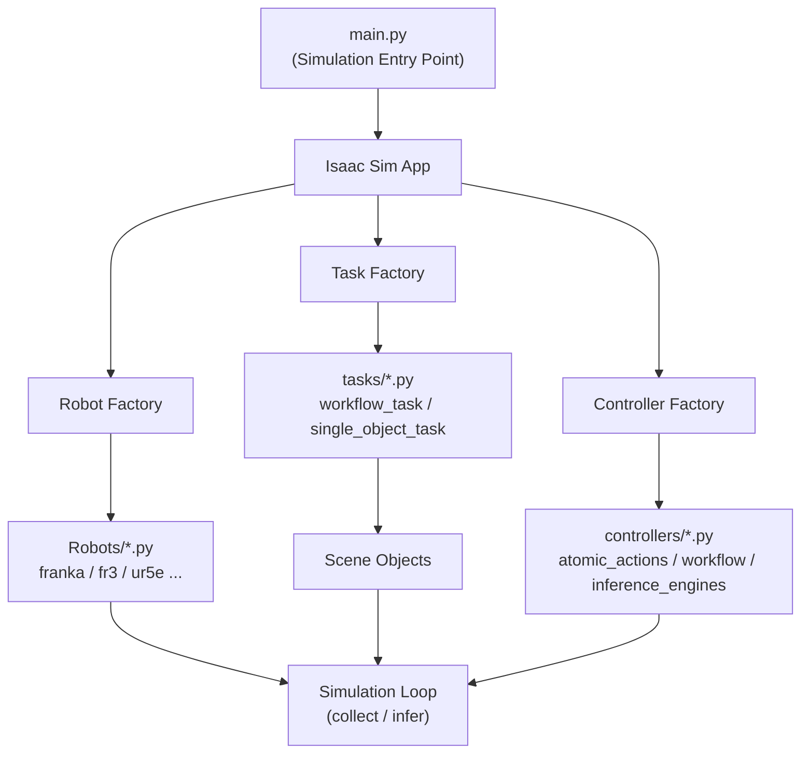

# Architecture

## Design Philosophy

RoboGenesis follows a layered architecture that separates concerns between scene management (handled by Tasks) and execution control (handled by Controllers).

### Layer Overview

| Layer | Description |
|-------|-------------|
| **L5 Community** | Documentation, plugin hub |
| **L4 Distribution** | pip install, Docker, GitHub Pages |
| **L3 Observability** | Structured logs, replay, debug |
| **L2 Reliability** | Offline assets, tests, seeds |
| **L1 Core Engine** | Robots, skills, workflow, data |

### L1 Core Engine

The core engine consists of six primary subsystems:

| Subsystem | Description |
| --- | --- |
| Robots | Robot arm implementations, RMPFlow motion planning |
| Skills | Atomic action controllers (pick, place, pour, ...) |
| Tasks | Scene setup, observation acquisition, state management |
| Factories | Factory pattern (robot/task/controller/collector) |
| Data Collection | HDF5 episode writing, data collection |

---

## System Architecture Diagram



---

## Task ↔ Controller Separation

### Task Layer

Tasks handle what the robot perceives (observation acquisition) and what objects exist in the scene (scene state management).

Responsibilities include:

- Camera setup (RGB, depth, point cloud, segmentation)
- Object position initialization and randomization
- Material/appearance configuration for OOD generalization
- Scene state queries (get object positions, camera data)
- Episode reset and object re-initialization

### Controller Layer

Controllers handle how the robot acts (action computation) and whether the task succeeded (success checking).

Responsibilities include:

- Motion planning via RMPFlow
- Gripper open/close control
- Atomic skill state machines (pick, place, pour, ...)
- Workflow orchestration (multi-step skill sequencing)
- Success condition evaluation

---

## Configuration Architecture

RoboGenesis uses Hydra for configuration management. All configurations are YAML-based.

```
config/
├── atomic_skills/           # Single-skill configs
│   ├── pick.yaml            # Default (Franka)
│   ├── place.yaml
│   ├── pour.yaml
│   └── ...
│   ├── franka/              # Robot-specific overrides
│   ├── fr3/
│   ├── ur5e/
│   └── ...
├── workflows/               # Multi-step workflows
│   ├── workflow_pick_pour.yaml
│   ├── workflow_clean_beaker.yaml
│   └── ...
├── object_properties.yaml   # Per-object geometry
├── simulation.yaml          # Physics parameters
└── composite_skills.yaml    # Skill compositions
```

### Config Override Pattern

```bash
# Default (Franka)
python main.py --config-name atomic_skills/pick

# Override robot type
python main.py --config-name atomic_skills/pick --override robot.type=rizon4

# Override robot position
python main.py --config-name atomic_skills/pick --override robot.position=[0,0,0.71]
```

---

## Robot Architecture

### Base Class

`robots/base/generic_arm.py` provides a reusable base class:

```python
class GenericArm(Robot):
    ARM_DOF                    # Number of arm joints
    GRIPPER_TYPE               # "prismatic" or "revolute"
    GRIPPER_DOF_INDICES        # Gripper joint indices
    GRIPPER_OPEN / GRIPPER_CLOSED  # Gripper positions
    TCP_OFFSET_LOCAL           # Flange to TCP offset
```

### Robot Registry

All robots are registered in two places:

- `controllers/robot_configs/registry.py` — ROBOT_CONFIGS dict
- `factories/robot_factory.py` — _CLASS_NAME_MAP dict

### Adding a New Robot

1. Create `robots/new_arm/new_arm.py` inheriting from GenericArm
2. Register in ROBOT_CONFIGS and _CLASS_NAME_MAP
3. Create `config/atomic_skills/new_arm/pick.yaml`
4. Run `python scripts/check_registrations.py` to verify

See [Adding a New Robot](../Robots/adding-new-robot.md) for detailed tutorial.

---

## Workflow Engine Architecture

```
WorkflowEngine
├── SkillExecutor           # Dispatches skills to controllers
├── TransitionManager      # Handles skill transitions
├── SuccessConditionManager # Per-skill success checking
├── HeldObjectContext      # Tracks held objects
└── StepTracker            # Records execution history
```

Execution Flow:

1. Episode warmup (physics settling)
2. Transition settling (if switching skills)
3. Skill execution via SkillExecutor.dispatch()
4. Success condition checking
5. Transition to next skill or finish

---

## Data Collection Architecture

```
DataCollector (HDF5)
├── EpisodeWriter          # Writes single episode
├── ResumableCollector     # Supports resume after中断恢复
└── MultiCamSupport        # Multiple camera streams
```

Collected Data:

- RGB/depth images from configured cameras
- Robot joint positions and velocities
- End-effector poses
- Gripper states
- Timestamps

---

## Key Files Reference

| Purpose | File |
| --- | --- |
| Entry point | main.py |
| Base robot class | robots/base/generic_arm.py |
| Base controller | controllers/base_controller.py |
| Base task | tasks/base_task.py |
| Robot factory | factories/robot_factory.py |
| Task factory | factories/task_factory.py |
| Controller factory | factories/controller_factory.py |
| Workflow engine | controllers/workflow/workflow_engine.py |
| Skill executor | controllers/workflow/skill_executor.py |
| Data collector | data_collectors/data_collector.py |
