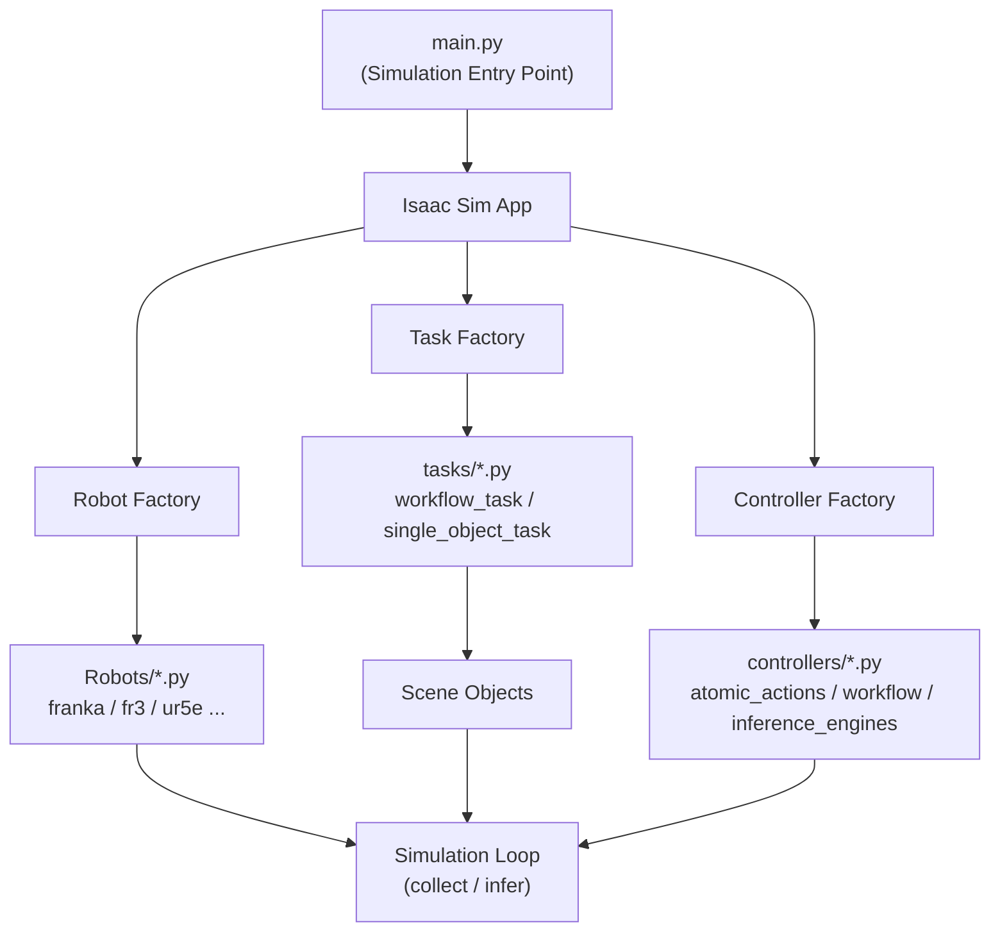

# 架构

## 设计理念

RoboGenesis 采用分层架构，将场景管理（由 Tasks 处理）和执行控制（由 Controllers 处理）分离。

### 层级概览

| 层级 | 描述 |
| --- | --- |
| **L5 社区层** | 文档、插件中心 |
| **L4 发行层** | pip 安装、Docker、GitHub Pages |
| **L3 可观测层** | 结构化日志、回放、调试 |
| **L2 可靠性层** | 离线资产、测试、随机种子 |
| **L1 核心引擎层** | 机械臂、技能、工作流、数据 |

### L1 核心引擎

核心引擎由六个主要子系统组成：

<div style="text-align: center; margin: 1.5em 0;" markdown>

| 子系统 | 描述 |
| --- | --- |
| Robots | 机械臂实现，RMPFlow 运动规划 |
| Controllers | 原子技能控制器 (`controllers/atomic_actions/`) |
| Workflow | 多步骤任务编排 |
| Tasks | 场景管理和观测获取 |
| Factories | 用于创建机器人、任务、控制器的工厂模式 |
| Data Collectors | 数据采集和存储 (`data_collectors/`) |

</div>

---

## 系统架构图



---

## Task ↔ Controller 分离

### Task 层

Tasks 负责机器人感知什么（观测获取）和场景中存在什么对象（场景状态管理）。

职责包括：

- 相机设置（RGB、深度、点云、分割）
- 对象位置初始化和随机化
- 材质/外观配置用于分布外泛化
- 场景状态查询（获取对象位置、相机数据）
- Episode 重置和对象重新初始化

### Controller 层

Controllers 负责机器人如何行动（动作计算）和任务是否成功（成功检查）。

职责包括：

- 通过 RMPFlow 进行运动规划
- 夹爪开/关控制
- 原子技能状态机（pick, place, pour, ...）
- 工作流编排（多步骤技能排序）
- 成功条件评估

---

## 配置系统

RoboGenesis 使用 Hydra 进行配置管理。所有配置均为 YAML 格式。

```text
config/
├── atomic_skills/           # 单技能配置
│   ├── pick.yaml            # 默认（Franka）
│   ├── place.yaml
│   ├── pour.yaml
│   └── ...
│   ├── franka/              # 机器人特定覆盖
│   ├── fr3/
│   ├── ur5e/
│   └── ...
├── workflows/               # 多步骤工作流
│   ├── workflow_pick_pour.yaml
│   ├── workflow_clean_beaker.yaml
│   └── ...
├── object_properties.yaml   # 每对象几何
├── simulation.yaml          # 物理参数
└── composite_skills.yaml    # 技能组合

```

### 配置覆盖模式

```bash
# 默认（Franka）

python main.py --config-name atomic_skills/pick
# 覆盖机器人类型

python main.py --config-name atomic_skills/pick --override robot.type=rizon4
# 覆盖机器人位置

python main.py --config-name atomic_skills/pick --override robot.position=[0,0,0.71]

```

---

## 机械臂架构

### 基础类

robots/base/generic_arm.py 提供了一个可重用的基础类：

```python
class GenericArm(Robot):
    ARM_DOF                    # Number of arm joints
    GRIPPER_TYPE               # "prismatic" or "revolute"
    GRIPPER_DOF_INDICES        # Gripper joint indices
    GRIPPER_OPEN / GRIPPER_CLOSED  # Gripper positions
    TCP_OFFSET_LOCAL           # Flange to TCP offset
```

### 机器人注册

所有机器人在两个地方注册：

- controllers/robot_configs/registry.py — ROBOT_CONFIGS 字典
- factories/robot_factory.py — _CLASS_NAME_MAP 字典

### 添加新机械臂

1. 创建 robots/ 新机械臂 / 新机械臂 .py 继承自 GenericArm
2. 在 ROBOT_CONFIGS 和 _CLASS_NAME_MAP 中注册
3. 创建 config/atomic_skills/ 新机械臂 /pick.yaml
4. 运行 python scripts/check_registrations.py 进行验证

详见[添加新机械臂教程](../Robots/adding-new-robot.md)。

---

## 工作流引擎

```text
WorkflowEngine
├── SkillExecutor           # 将技能分派到控制器
├── TransitionManager      # 处理技能转换
├── SuccessConditionManager # 每个技能的成功检查
├── HeldObjectContext      # 跟踪抓取的对象
└── StepTracker            # 记录执行历史

```

执行流程：

1. Episode 预热（物理 settling）
2. 转换 settling（如果切换技能）
3. 通过 SkillExecutor.dispatch() 执行技能
4. 成功条件检查
5. 转换到下一个技能或完成

---

## 数据采集


```

DataCollector (HDF5)
├── EpisodeWriter          # 写入单个 episode
├── ResumableCollector     # 支持中断恢复
└── MultiCamSupport        # 多相机流

```

采集的数据：

- 来自配置相机的 RGB/深度图像
- 机器人关节位置和速度
- 末端执行器姿态
- 夹爪状态
- 时间戳

---

## 关键文件参考

<div style="text-align: center; margin: 1.5em 0;" markdown>

| 用途 | 文件路径 |
| --- | --- |
| 入口点 | `main.py` |
| 机器人工厂 | `factories/robot_factory.py` |
| 任务工厂 | `factories/task_factory.py` |
| 控制器工厂 | `factories/controller_factory.py` |
| 基础机器人类 | `robots/base/generic_arm.py` |
| 基础控制器 | `controllers/base_controller.py` |
| 基础任务 | `tasks/base_task.py` |
| 工作流引擎 | `controllers/workflow/workflow_engine.py` |
| 技能执行器 | `controllers/workflow/skill_executor.py` |
| 技能注册表 | `controllers/workflow/skill_registry.py` |
| 技能默认值 | `controllers/workflow/skill_defaults.py` |
| 成功条件 | `controllers/workflow/success_conditions/` |
| 数据采集器 | `data_collectors/data_collector.py` |
| 配置验证器 | `lab_utils/config_schema.py` |
| 结构化日志 | `lab_utils/labgen_logger.py` |
| 确定性种子 | `lab_utils/seeding.py` |
| 注册自检 | `scripts/check_registrations.py` |
| Episode 回放 | `scripts/labgen_replay.py` |
| Episode 调试 | `scripts/labgen_debug.py` |
| 并行采集 | `scripts/labgen_parallel.py` |

</div>
